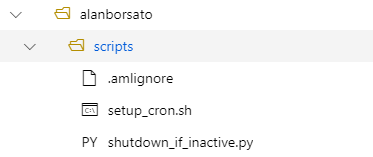
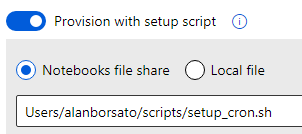

# Azure Machine Learning Compute Instance - Helper Snippets

This repo hosts a few code snippets for:

* Shutting down all Compute Instances in a Workspace
* Starting up all Compute Instances in a Workspace
* Shutting down a Compute Instance if all notebooks had been idleing for one hour (uses `cron` inside the Compute Instance)

## Creating a Compute Instance with auto-shutdown

1. Copy all files from the `shutdown-if-inactive` folder into your Azure Machine Learning workspace

   

2. Create a new Compute instance using the `setup_cron.sh` as setup script

   

3. After 1h idle, the compute instance should shutdown. Otherwise, run the script in a new terminal window to make sure the job is running successfully:
   ```bash
   watch /tmp/shutdown.log
   # or
   tail -f /tmp/shutdown.log
   ```
